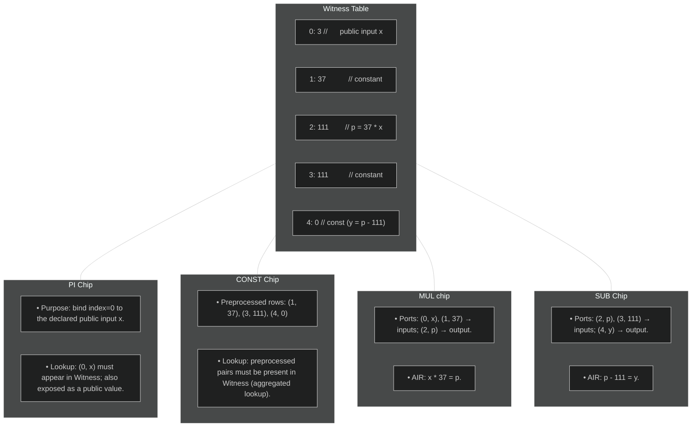

# Recursion Approach and Construction

## High-level architecture

Recursion in zero-knowledge proofs means using one proof to verify another: an (outer) prover will generate a proof 
to assert validity of an (inner) STARK proof. By applying this recursively, one obtains a (possibly compact) outer proof that attests to arbitrarily deep chains of computation.

Our approach to recursion for Plonky3 differs from a traditional zkVM approach: there is **no program counter, instruction set, or branching logic**. Instead, a fixed program is chosen, and the verifier circuit is specialized to this program only.

## Why fixing the program shape?

- **Performance**: without program counter logic, branching, or instruction decoding,
  the verifier’s constraints are much lighter.

- **Recursion efficiency**: since the shape of the trace is predetermined,
  the recursion circuit can be aggressively optimized.

- **Simplicity**: all inputs follow the same structural pattern, which keeps
  implementation complexity low.

## Limitations

- **Rigidity**: only the supported program(s) can be proven.

- **No variable-length traces**: input size must fit the circuit’s predefined structure.

- **Reusability**: adapting to a new program requires a new circuit.

The rest of this book explains how this approach is built, [how to soften its rigidity](extensions.md#strategies),
and why it provides a powerful foundation for recursive proof systems.

## Execution IR

An **Execution IR** (intermediate representation) is defined to describe the steps of the verifier.
This IR is *not proved itself*; it only guides trace population.
The actual soundness comes from the constraints inside the operation-specific STARK chips along with their lookups into the central witness table.

In the IR, we differentiate between *primitive* and *nonprimitive operations*. 

Primitive operations represent basic field arithmetic operations:

- `Constant` -- for constants,
- `Public` -- for public inputs,
- `Add` -- for both addition and subtraction,
- `Mul` -- for both multiplication and division. 

They represent the core of the verification computation. Given only the primitive operations, one should be able to carry out most operations necessary in circuit verification. Primitive operations have the following properties:

- They operate on elements of the witness table, through their `WitnessId` (index within the witness table).
- The representation can be heavily optimized. For example, every time a constant is added to the IR, we wither create a new `WitnessId` or return an already existing one. We could also carry out common subexpression elimination.
- They are executed in topological order during the circuit evaluation, and
- they form a directed acyclic graph of dependencies.

But relying only on primitive operations for the entire verification would lead to the introduction of many temporary values in the IR. In turn, this would lead to enlarged witness and primitive tables. This can be alleviated by the introduction of chips which carry out more complex operations: *nonprimitive operations*. These have more complex constraints, for example for sensitive cryptographic operations, and are verified by specialized AIRs. As such, they cannot be optimized similarly to primitive operations.

These nonprimitive operations use not only witness table elements (including public inputs), but may also require the use of *private data*. For example, when verifying a Merkle path, hash outputs are not stored in the witness table. Nonprimitive operations make it easy to add *complex functionality*, and therefore contribute to the *modularity* of the system.

In our implementation of the recursive verifier, we leverage the following nonprimitive operation:

- `MerkleVerify` -- to verify the inclusion of a leaf in a Merkle tree (in other words, it is used to verify a Merkle path)

In order to generate the IR, the first step is to create all operations symbolically.

In the symbolic executor, the computation is represented as a graph where nodes are called either `ExprId` (since they represent the index of an expression) or `Target` in the code. Each `Target` (expression) can be:

- a constant, 
- a public input, 
- the output of a primitive operation. 

Nonprimitive operations can use `Target`s, but they do not introduce new ones. 

We then need to lower these `Target`s to the IR, thus allocating actual slots in the witness table. Slot allocation cannot be carried out beforehand, as some `Target`s are connected through expressions and should therefore share the same slot in the witness table.

The computation graph that represents all primitive and nonprimitive operations in the IR is called `circuit`. 

A `circuit_builder` manages the insertion of operations in the graph thanks to methods like `connect` (for ensuring that the values associated to two witness indices are equal), `sub` (for subtraction), `add_public_input` (for adding a new public input) etc. The `build()` method:

- lowers graph expressions to primitives: it allocates slots in the witness tables, and creates the operations on the witness slots directly (instead of `Target`s)
- optimizes the primive operations when possible,
- and returns the full `circuit`.

## Witness Table

The Witness table is a central bus that stores values shared across operations. It gathers the pairs `(index, value)` that will be accessed by 
the different chips via lookups to enforce consistency.

- The index column is *preprocessed* [@@rap]: it is known to both prover and verifier in advance, requiring no online commitment.[^1]
- The Witness table values are represented as extension field elements directly (where base field elements are padded with 0 on higher coordinates) for addressing efficiency.

## Operation-specific STARK Chips

Each operation family (e.g. addition, multiplication, Merkle path verification, FRI folding) has its own chip.

A chip contains:

- Local columns for its variables.
- Lookup ports into the witness table.
- An AIR that enforces its semantics.

**Primitive operations**: 

Note that in the following tables, all index columns are preprocessed.

- `WitnessAir`:

  - It is the central AIR in our construction. It represents the global witness bus: it stores all witness indices and associated values used in the verifier circuit.

  - ***columns***: the AIR has `D + 1` columns. They correspond to: `1` column for the index of the element, and `D` columns to store the value. Note that in this table, indices are incremented at each row.

  - ***constraints***: In the first row, ensure that `index = 0`. For transitions: `index_next - index_current - 1` (since indices are incremented). This table also carries out interactions with all the other AIRs, since it is used to connect values betweem tables.

- `ConstAir`:

  - It stores constants either in the base field or the extension field (of extension degree `D`).

  - ***columns***: The AIR has `D + 1` columns. They correspond to: `1` column for the index of the constant within the witness table, and `D` columns to store the value.

  - ***constraints***: There are no constraints in this air. The values are verified thanks to interactions with the witness table only.

- `AddAir`: 

  - It deals with addition and subtraction. In the case of subtraction, `a - b = c` is written in the table as `b + c = a`. The chip handles both base field and extension field operations, depending on the extensions degree `D`. It can also handle multiple operations on the same row, making it easier to control the width and height of the table.

  - ***columns***: The AIR has `3 * D + 3` columns for each operation. Each of the left input `left`, right input `right` and the `output` is represented as `D` columns. The extra `3` columns correspond to the witness index of `left, right` and `output`.

  - ***constraints***: For each triple `(left, right, output)`: `left[i] + right[i] - output[i]`, for `i` in `0..D`. `left, right` and `output` are then checked against the witness table (through interactions), using their respective witness index.

- `MulAir`:

  - It deals with multiplication and division. In the case of division, `a / b = c` is written in the table as `b * c = a`. The chip handles both base field and extension field operations, depending on the extensions degree `D`. It can also handle multiple operations on the same row, making it easier to control the width and height of the table.

  - ***columns***: The AIR has `3 * D + 3` columns for each operation. Each of the left input `left`, right input `right` and the `output` is represented as `D` columns. The extra `3` columns correspond to the witness index of `left, right` and `output`.

  - ***constraints***: For each triple `(left, right, output)`: `left * right[i] - output[i]`. The multiplication is carried out in the extension field when `D > 1`. `left, right` and `output` are then checked against the witness table (through interactions), using their respective witness index.

**NonPrimitive Operations**:

- `MerkleVerifyAir`:

  - It is used to batch verify a Merkle path. Given a leaf, a merkle root, a list of siblings and a leaf index, it checks that the leaf at the leaf index is indeed part of the Merkle tree. The AIR assumes that leaf elements are hash digests of the form `[F; DIGEST_ELEMS]` where `F` is the base field and `DIGEST_ELEMS` is a constant equal to the number of digest elements of the hash. The AIR also has a maximal tree height that it can handle: `MAX_TREE_HEIGHT`. Note that each batch merkle verification is comprised of multiple rows.

  - ***columns***:

    - `MAX_TREE_HEIGHT` columns for `index_bits`: `index_bits` are the bits of the leaf index within the Merkle tree

    - 1 column for `length`: `length` is the actual maximal height of the batch of Merkle trees we are currently verifying. It is also equal to the length of `index_bits`

    - `MAX_TREE_HEIGHT` columns for `height_encoding`: it is the one-hot encoding of the currently processed height within one merkle path verification

    - `DIGEST_ELEMS` columns for `sibling`: it corresponds to the provided sibling for `height_encoding`

    - `DIGEST_ELEMS` columns for `state`: it is the current state of the hash, which we are updating. After `length` updates, the `state` should be equal to the Merkle root

    - 1 column for `is_final`: it is a boolean flag indicating whether the current Merkle path verification for the leaf at index `index_bits` is over

    - 1 column for `is_extra`: it is a boolean flag for batch verification. A batch of Merkle trees is not necessarily composed only of trees of the same height. When a shorter tree has height `h`, then we should add its leaves to the current hash when `height_encoding` represents height `h`

    - 1 column for `extra_height`: it is used when `is_extra` is true. When there is an extra step due to batching, we need to store the height at which the extra step occurred. The height can then be used to ensure soundness thanks to an interaction with the FRI verification.

  - ***constraints***: 

    - check boolean values:

      - `index_bits` columns
      - `height_encoding` columns
      - `is_real`
      - `is_extra`

    - check that the current `is_extra` and `is_final` as well as the next row's `is_final` cannot be set to true at the same time. This is because `is_extra` can only be set to true before a hash with a sibling at the current height.

    - check that the height encoding is indeed a one-hot encoding (in non-padding columns, exactly one encoding column is set to 1)

    - check that `index_bits` and `length` remain unchanged within the same path verification

    - check that the height encoding is constructed correctly

    - check that if the current row is a padding row, the next row is also a padding row (this ensures that a malicious prover cannot introduce rows that would be ignored by the constraints in the middle of an actual verification)

    - interactions with the FRI verifier and the hash table ensure that the inputs of the AIR and the hash outputs are correct.

## Lookups

All chips interactions are performed via a lookup argument against the central Witness table. Enforcing multiset equality between chip ports and the Witness table entries ensures correctness without proving the execution order of the entire IR itself.

Below is a representation of the interactions between the main Witness table and the different chips.

[^1]: Preprocessed columns / polynomials can be reconstructed manually by the verifier, removing the need for a prover to commit to them and later perform the FRI protocol on them. However, the verifier needs $O(n)$ work when these columns are not structured, as it still needs to interpolate them. To alleviate this, the Plonky3 recursion stack performs *offline* commitment of unstructured preprocessed columns, so that we need only one instance of the FRI protocol to verify all preprocessed columns evaluations. 