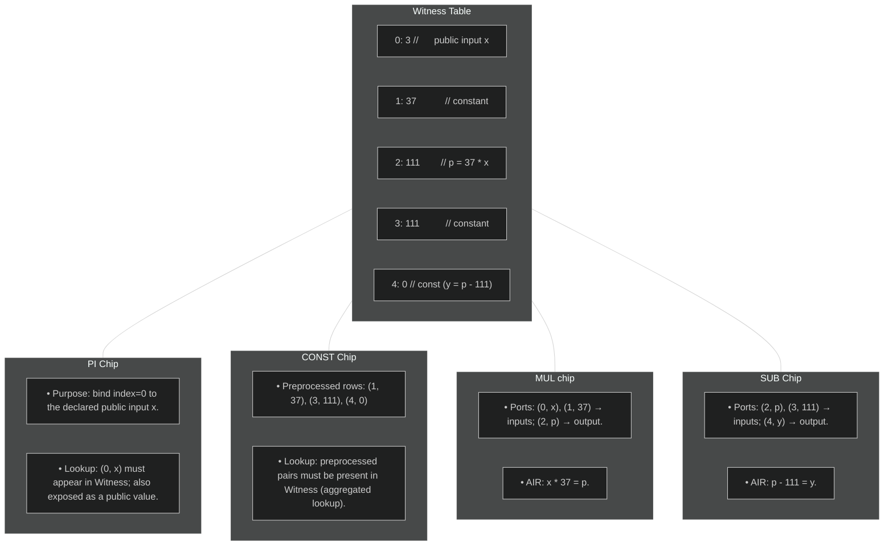

# Recursion Approach and Construction

## High-level architecture

Recursion in zero-knowledge proofs means using one proof to verify another: an (outer) prover will generate a proof 
to assert validity of an (inner) STARK proof. By applying this recursively, one obtains a (possibly compact) outer proof that attests to arbitrarily deep chains of computation.

Our approach to recursion for Plonky3 differs from a traditional zkVM approach: there is **no program counter, instruction set, or branching logic**. Instead, a fixed program is chosen, and the verifier circuit is specialized to this program only.

## Why fixing the program shape?

- **Performance**: without program counter logic, branching, or instruction decoding,
  the verifier’s constraints are much lighter.

- **Recursion efficiency**: since the shape of the trace is predetermined,
  the recursion circuit can be aggressively optimized.

- **Simplicity**: all inputs follow the same structural pattern, which keeps
  implementation complexity low.

## Limitations

- **Rigidity**: only the supported program(s) can be proven.

- **No variable-length traces**: input size must fit the circuit’s predefined structure.

- **Reusability**: adapting to a new program requires a new circuit.

The rest of this book explains how this approach is built, [how to soften its rigidity](extensions.md#strategies),
and why it provides a powerful foundation for recursive proof systems.

## Execution IR

An **Execution IR** (intermediate representation) is defined to describe the steps of the verifier.
This IR is *not proved itself*; it only guides trace population.
The actual soundness comes from the constraints inside the operation-specific STARK chips along with their lookups into the central witness table.

In the IR, we differentiate between *primitive* and *nonprimitive operations*. 

Primitive operations represent the core of the verification computation, and will always be available when building a recursive verifier, regardless of the sub-protocols and parameterization:

- `Constant` -- for constants,
- `Public` -- for public inputs,
- `Add` -- for both addition and subtraction,
- `Mul` -- for both multiplication and division. 

Given only the primitive operations, one should be able to carry out most operations necessary in circuit verification. Primitive operations have the following properties:

- They operate on elements of the witness table, through their `WitnessId` (index within the witness table).
- The representation can be heavily optimized. For example, every time a constant is added to the IR, we either create a new `WitnessId` or return an already existing one. We could also carry out common subexpression elimination.
- They are executed in topological order during the circuit evaluation, and
- they form a directed acyclic graph of dependencies.

But relying only on primitive operations for the entire verification would lead to the introduction of many temporary values in the IR. In turn, this would lead to enlarged witness and primitive tables. This can be alleviated by the introduction of chips which carry out more complex operations: *nonprimitive operations*. These have more complex constraints, for example for sensitive cryptographic operations, and are verified by specialized AIRs. As such, they cannot be optimized similarly to primitive operations.

These nonprimitive operations use not only witness table elements (including public inputs), but may also require the use of *private data*. For example, when verifying a Merkle path, hash outputs are not stored in the witness table. Nonprimitive operations make it easy to add *complex functionality*, and therefore contribute to the *modularity* of the system.

In our implementation of the recursive verifier, we leverage the following nonprimitive operation:

- `MerkleVerify` -- to verify the inclusion of a leaf in a Merkle tree (in other words, it is used to verify a Merkle path)

In order to generate the IR, the first step is to create all operations symbolically.

In the symbolic executor, the computation is represented as a graph where nodes are called either `ExprId` (since they represent the index of an expression) or `Target` in the code. Each `Target` (expression) can be:

- a constant, 
- a public input, 
- the output of a primitive operation. 

Nonprimitive operations can use `Target`s, but they do not introduce new ones. 

We then need to lower these `Target`s to the IR, thus allocating actual slots in the witness table. Slot allocation cannot be carried out beforehand, as some `Target`s are connected through expressions and should therefore share the same slot in the witness table.

The computation graph that represents all primitive and nonprimitive operations in the IR is called `circuit`. 

A `circuit_builder` manages the insertion of operations in the graph thanks to methods like `connect` (for ensuring that the values associated to two witness indices are equal), `sub` (for subtraction), `add_public_input` (for adding a new public input) etc. The `build()` method:

- lowers graph expressions to primitives: it allocates slots in the witness tables, and creates the operations on the witness slots directly (instead of `Target`s)
- optimizes the primive operations when possible,
- and returns the full `circuit`.

## Witness Table

The Witness table is a central bus that stores values shared across operations. It gathers the pairs `(index, value)` that will be accessed by 
the different chips via lookups to enforce consistency.

- The index column is *preprocessed* [@@rap]: it is known to both prover and verifier in advance, requiring no online commitment.[^1]
- The Witness table values are represented as extension field elements directly (where base field elements are padded with 0 on higher coordinates) for addressing efficiency.


## Operation-specific STARK Chips

Each operation family (e.g. addition, multiplication, Merkle path verification, FRI folding) has its own chip.

A chip contains:

- Local columns for its variables.
- Lookup ports into the witness table.
- An AIR that enforces its semantics.

**Toy Example**

To illustrate how the various chips interact when carrying out a recursive verification, we can consider a toy example.

Let us assume that we want to prove the verification of the following constraint: `37 * x - 111 = 0`, for a public input `x`.

First, we introduce a public input `x` at index 0, and three constants `c_1 = 0`, `c_2 = 37` and `c_3 = 111` at indices 1, 2 and 3 respectively. Using the `circuit_builder` mentioned in the section "Execution IR", the code is as follows:

```
let x = circuit_builder.add_public_input();
let zero = circuit_builder.add_const(0);
let c_1 = circuit_builder.add_const(37);
let c_2 = circuit_builder.add_const(111);
```

We then add the constraint to the circuit:
```
let mul = circuit_builder.mul(c_1, x);      // 37 * x, at index 4
let output = circuit_builder.sub(mul, c_2); // 37 * x - 111
circuit_builder.connect(output, zero);      // 37 * x - 111 = 0 
```

Let us now generate `WitnessAir`, `ConstAir`, `MulAir` and `AddAir` with public input `x = 3`. Here, we assume that we are in the base field for simplicity.

Note that in the following tables, all `index` columns are preprocessed.

***Witness***

| Index | Value |
|-------|-------|
|   0   |   3   |
|   1   |   0   |
|   2   |   37  |
|   3   |   111 |
|   4   |   111 |

The AIR ensures that the `Index` is computed correctly, in an incremental fashion.

Since we called `circuit_builder.connect(output, zero)`, lowering the symbolic representation of the constraint does not introduce a new element in the `Witness` table: both `output` and `zero` share the witness index `0`.

See [here][https://github.com/Plonky3/Plonky3-recursion/blob/02eee5ce998025259f245a3ce257a93d77f6fd63/circuit-prover/src/air/witness_air.rs] for more details on `WitnessAir`.

***ConstAir***

| Index | Value |
|-------|-------|
|   1   |   0   |
|   2   |   37  |
|   3   |   111 |

See [here][https://github.com/Plonky3/Plonky3-recursion/blob/02eee5ce998025259f245a3ce257a93d77f6fd63/circuit-prover/src/air/const_air.rs] for more details on `ConstAir`.

***MulAir***

| Index_1 | Left | Index_2 | Right | Index_3 | Result |
|---------|------|---------|-------|---------|--------|
|    2    |  37  |    0    |   3   |    4    |   111  |

This table has the following constraint, to ensure soundness: `left * right - result`.

See [here][https://github.com/Plonky3/Plonky3-recursion/blob/02eee5ce998025259f245a3ce257a93d77f6fd63/circuit-prover/src/air/mul_air.rs] for more details on `MulAir`.

***AddAir***

Note that we use `AddAir` for subtractions as well, since we can rewrite: `a - b = c` as `b + c = a`.

| Index_1 | Left | Index_2 | Right | Index_3 | Result |
|---------|------|---------|-------|---------|--------|
| 3       | 111  | 1       | 0     | 4       | 111    |

This table has the following constraint, to ensure soundness: `left + right - result`.

See [here][https://github.com/Plonky3/Plonky3-recursion/blob/02eee5ce998025259f245a3ce257a93d77f6fd63/circuit-prover/src/air/add_air.rs] for more details on `AddAir`.

***Interactions***

Each AIR verifies its constraints, and ensures that the primitive (and nonprimitive, if there are any) operations are correctly computed. But we still need to ensure that we are building the correct circuit (in this toy example, we need to ensure that we are indeed constructing the constraint `37 * x - 111 = 0`). This is done via interactions with the `Witness` table (there might be different interactions when nonprimitive operations are involved). 

Since the index of each element is unique in the `Witness` table, the interaction: `(Index, Value)` from each table (other than `Witness`) with `Witness` enforces that the correct elements are sent to the right places. For example, `AddAir`, sends `(4, 111)`, `(3, 111)` and `(1, 0)` to the `WitnessAir`. Since index `4` stores the output `p = 37 * x` and index `3` stores the constant `111`, the interaction ensures that we are carrying out the subtraction: `p - 111 = 37 * x - 111`. Moreover, since index `1` stores the constant `0`, the interaction ensures that the output of the subtraction is `0`.  

## Lookups

All chips interactions are performed via a lookup argument against the central Witness table. Enforcing multiset equality between chip ports and the Witness table entries ensures correctness without proving the execution order of the entire IR itself.

Below is a representation of the interactions between the main Witness table and the different chips.




[^1]: Preprocessed columns / polynomials can be reconstructed manually by the verifier, removing the need for a prover to commit to them and later perform the FRI protocol on them. However, the verifier needs $O(n)$ work when these columns are not structured, as it still needs to interpolate them. To alleviate this, the Plonky3 recursion stack performs *offline* commitment of unstructured preprocessed columns, so that we need only one instance of the FRI protocol to verify all preprocessed columns evaluations. 